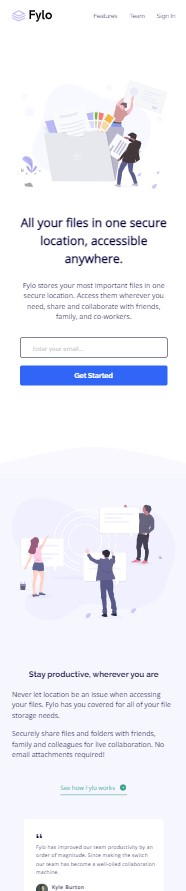
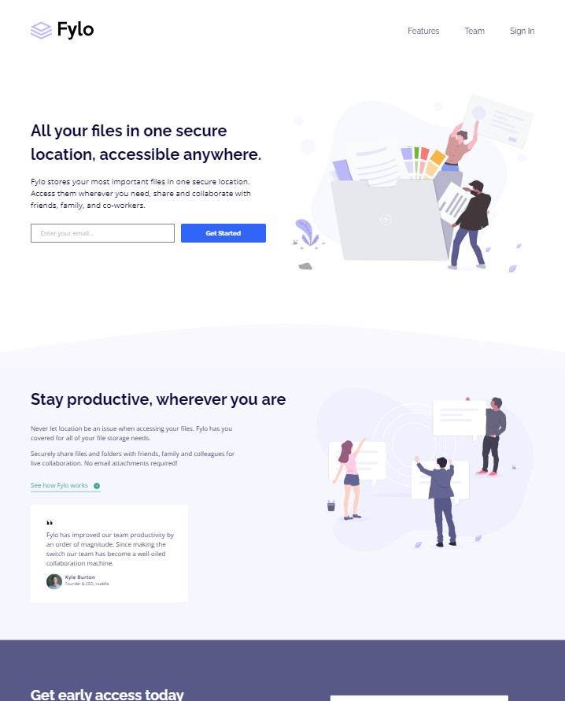
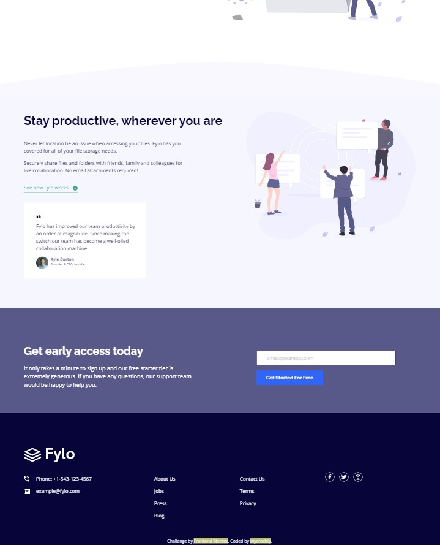

# Frontend Mentor - Fylo landing page with two column layout solution

This is a solution to the [Fylo landing page with two column layout challenge on Frontend Mentor](https://www.frontendmentor.io/challenges/fylo-landing-page-with-two-column-layout-5ca5ef041e82137ec91a50f5). Frontend Mentor challenges help you improve your coding skills by building realistic projects. 

## Table of contents

- [Overview](#overview)
  - [The challenge](#the-challenge)
  - [Screenshot](#screenshot)
  - [Links](#links)
- [My process](#my-process)
  - [Built with](#built-with)
  - [What I learned](#what-i-learned)
  - [Continued development](#continued-development)
- [Author](#author)


## Overview

### The challenge

Users should be able to:

- View the optimal layout for the site depending on their device's screen size
- See hover states for all interactive elements on the page


### Screenshot

#### Moble View - 375px
 

#### Desktop View - 1440px
 


### Links

- Solution URL: [GitHub](https://github.com/mycrochip/fylo-landing-page-with-two-column-layout.git)

- Live Site URL: [GitHub Pages](https://mycrochip.github.io/fylo-landing-page-with-two-column-layout/)


## My process

### Built with

- Semantic HTML5 markup
- CSS custom properties
- Javascript
- Flexbox
- Mobile-first workflow


### What I learned

This is my very first attempt at utilizing javascript in my projects. I used javascript to add functionality to the forms only. Ths nav in this projects does not require the use of javascript. 

```css
.proud-of-this-css {
  /*Wrote my first over 500 lines of pure CSS 🎉*/
}
```
```js
// Handle Event
heroBtn.addEventListener("click", (e) => {
    e.preventDefault()
    let submitted = handleFormClick(heroInput, heroSuccessMsg, heroFailureMsg) // I defined this functionality seperately
    if (submitted) { disableAllButtons() }
    return true
})

//Since there are two same forms on the page..
function disableAllButtons() {
    buttons = document.querySelectorAll("button")
    for (let i = 0; i < buttons.length; i++) {
        buttons[i].disabled = true
    }
}
```


### Continued development

I have always wanted to master a tool before use. I recently found out and am still learning to understand that "learning on the go is far more realistic than learning all before going. There's just too much to learn"

Besides, more projects to be completed on [FrotendEnd Mentor](https://www.frontendmentor.io/)!


## Author

- Frontend Mentor - [@mycrochip](https://www.frontendmentor.io/profile/mycrochip)
- Twitter - [@mycrochip_world](https://www.twitter.com/mycrochip_world)
